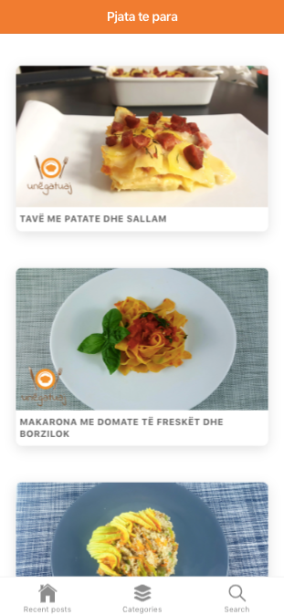
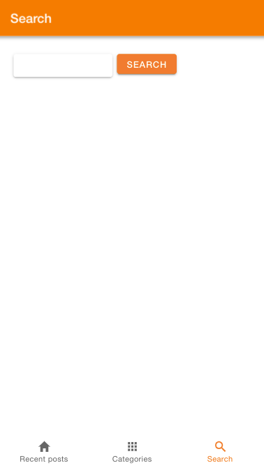

# ionic4-wordpress-app
Ionic 4 Wordpress app (iOS &amp; Android)

A simple app build with Ionic v4. 

- The app shows the latest posts. 
- The categories and browse posts by category
- Search through all posts
- Pagination

`npm start` to try it out

change the wordpress.com urls in `src/app/services/wordpress.service.ts`

If you have a self-hosted Wordpress blog it should work fine also with rest-api endpoints of your instance. 
https://developer.wordpress.org/rest-api/reference/ 
If you have a self-hosted wordpress blog change variable wp_org = true 
`public wp_org: boolean = true;` 
in `src/app/services/wordpress.service.ts`

It looks something like this: 

