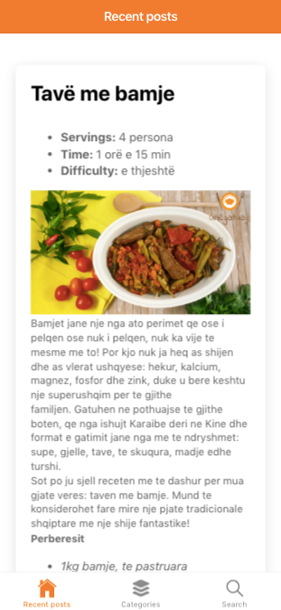

# ionic5-wordpress-app
Ionic 5 Wordpress app (iOS &amp; Android)

A simple app build with Ionic v5. 

- The app shows the latest posts. 
- The categories and browse posts by category
- Search through all posts
- Pagination

`npm start` to try it out

change the `mainUrl` variable in `src/app/services/wordpress.service.ts`

If you have a self-hosted Wordpress blog it should work fine also with rest-api endpoints of your instance. 
https://developer.wordpress.org/rest-api/reference/ 
If you have a self-hosted wordpress blog change variable wp_org = true 
`public wp_org: boolean = true;` 
in `src/app/services/wordpress.service.ts`

Please support this project by simply putting a Github star ⭐  
Share this library with friends on Twitter and everywhere else you can. 🙏

It looks something like this: 

